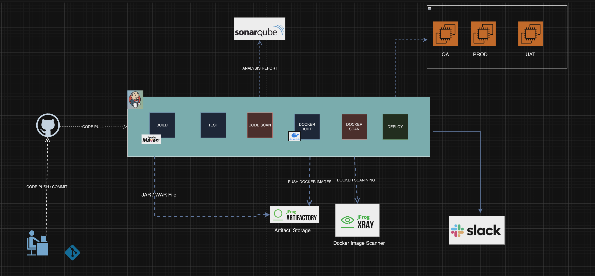

# Petclinic Application Deployment on QA and Production Environments

## Overview

This project demonstrates the deployment of the Petclinic application to QA and Production environments using a Jenkins pipeline. The pipeline automates the entire CI/CD workflow, integrating static code analysis, artifact storage, Docker image management, security scanning, and Ansible for deployment. Sensitive information like credentials and vault passwords are encrypted using Ansible Vault.

### **Pipeline Architecture Overview**



### Key Technologies

- **GitHub**: Version control and repository management for the application code and infrastructure scripts.
- **Jenkins**: CI/CD server orchestrating the entire build and deployment process.
- **Maven**: Build and dependency management tool used to compile and package the Java application.
- **SonarQube**: Platform for static code analysis, providing code quality metrics and security checks.
- **JFrog Artifactory**: Stores both the JAR files and Docker images.
- **JFrog X-Ray**: Scans Docker images for vulnerabilities before they are deployed.
- **Ansible**: Configuration management tool used to deploy the application to QA and Production servers.
- **Ansible Vault**: Encrypts sensitive information such as passwords and tokens.
- **Packer**: Tool used for provisioning infrastructure for Workstations, QA, Production servers, Jenkins, and SonarQube servers.

## Jenkins Pipeline

### Pipeline Flow

1. **Clone Repository**: The pipeline starts by cloning the application code from the GitHub repository.
2. **Unit Testing**: Maven runs the unit tests within the Petclinic application to ensure the code is functional.
3. **Static Code Analysis (SonarQube)**: The code is analyzed using SonarQube to detect bugs, vulnerabilities, and code smells.
4. **Build Package**: Maven is used to compile and package the application into a JAR file.
5. **Upload to Artifactory**: The compiled JAR file is uploaded to JFrog Artifactory for storage.
6. **Build Docker Image**: A Docker image is built for the Petclinic application using the JAR file.
7. **X-Ray Security Scan**: The Docker image is scanned for vulnerabilities using JFrog X-Ray.
8. **Push Docker Image**: The Docker image is pushed to Artifactory for storage and future deployment.
9. **Docker Pull**: The Docker image is pulled from Artifactory to the deployment environment.
10. **Deploy to QA or Production**: Ansible deploys the Docker image to the selected environment (QA or Production).
11. **Publish Build Info**: Build information is published to JFrog Artifactory.
12. **Slack Notifications**: The pipeline sends notifications about the build status to a Slack channel.
13. **Cleanup**: Workspace cleanup is performed to save disk space.


## Deployment Instructions

1. **Configure Jenkins**:
   - Install required Jenkins plugins: Git, Maven, JFrog CLI, SonarQube Scanner, Slack Notification.
   - Set up the required credentials in Jenkins (SonarQube token, Slack token, etc.).

2. **Provision Infrastructure**:
   - Use Packer to provision the Workstation, QA, and Production environments.
   - Ensure that Jenkins, SonarQube, and Artifactory servers are up and running.

3. **Run Jenkins Pipeline**:
   - Trigger the pipeline with the appropriate parameters for the environment (QA or Production).
   - Monitor the build process and check Slack for build notifications.

4. **Deployment**:
   - The pipeline deploys the Docker image to the selected environment (QA or Production) using Ansible.
   - Application runs on the specified port (default 8081)

### **How to Create a New Jenkins Job for the Project**

1. **Step 1: Access Jenkins Dashboard**
   - Open your Jenkins dashboard by accessing its URL (e.g., `http://<your-jenkins-server>:8080`).
   
2. **Step 2: Create a New Item**
   - Click on "New Item" on the Jenkins dashboard.
   - Provide a name for the job (e.g., `petclinic-pipeline`).
   - Select **Pipeline** as the type of project, then click **OK**.

3. **Step 3: Configure the Pipeline**
   - In the job configuration, scroll down to the **Pipeline** section.
   - Select **Pipeline script from SCM** under **Definition**.
   - In the **SCM** dropdown, select **Git**.

4. **Step 4: Set the Repository Details**
   - In the **Repository URL**, enter the URL of the GitHub repository:
     ```bash
     https://github.com/shegerbootcamp/docker-lab.git
     ```
   - Set the **Branch to build** to `master`.

5. **Step 5: Specify Jenkinsfile Location**
   - Under **Script Path**, enter:
     ```bash
     ci/Jenkinsfile.dev
     ```
     
### Parameters

The pipeline is parameterized to allow flexibility in configuration:

- `ProjectKey`: The SonarQube project key.
- `ProjectName`: The name of the SonarQube project.
- `SonarHostUrl`: URL of the SonarQube server.
- `SonarTokenCredentialId`: Jenkins credential ID for SonarQube access.
- `SlackChannel`: Slack channel to send build notifications.
- `SlackTokenCredentialId`: Jenkins credential ID for Slack access.
- `AppPort`: The port on which the application will run (e.g., 8081).
- `DeployEnvironment`: Allows choosing between QA and Production environments for deployment.

### Pipeline Structure

```groovy
pipeline {
    agent any
    tools {
        jfrog 'jfrog-cli'
    }

    parameters {
        // Parameter definitions for project, SonarQube, and Slack configuration
    }

    environment {
        DOCKER_IMAGE_NAME = "shegerlab2024.jfrog.io/petclinic/petclinic:${env.BUILD_NUMBER}"
    }

    stages {
        stage('Clone') {
            steps {
                git branch: 'master', url: "https://github.com/shegerbootcamp/docker-lab.git"
            }
        }

        stage('Unit Test') {
            steps {
                dir('petclinic-app') {
                    sh 'mvn test'
                }
            }
        }

        stage('Sonar Static Code Analysis') {
            steps {
                // SonarQube analysis steps
            }
        }

        stage('Build Package') {
            steps {
                dir('petclinic-app') {
                    sh 'mvn clean package'
                }
            }
        }

        stage('Upload to Artifactory') {
            steps {
                jf 'rt u target petclinic-jar/'
            }
        }

        stage('Build Docker Image') {
            steps {
                script {
                    docker.build("$DOCKER_IMAGE_NAME", 'petclinic-app')
                }
            }
        }

        stage('X-Ray Scan') {
            steps {
                jf 'docker scan $DOCKER_IMAGE_NAME'
            }
        }

        stage('Push Docker Image') {
            steps {
                jf 'docker push $DOCKER_IMAGE_NAME'
            }
        }

        stage('Deploy QA | PROD') {
            steps {
                script {
                    def playbook = params.DeployEnvironment == 'QA' ? 'ansible/deployer/deployer_qa.yml' : 'ansible/deployer/deployer_prod.yml'
                    sh "ansible-playbook -i ansible/deployer/inventory.ini ${playbook} --extra-vars 'DOCKER_IMAGE_NAME=${DOCKER_IMAGE_NAME}'"
                }
            }
        }

        stage('Publish Build Info') {
            steps {
                jf 'rt build-publish'
            }
        }
    }

    post {
        success {
            junit '**/target/surefire-reports/TEST-*.xml'
            archiveArtifacts 'target/*.jar'
        }

        always {
            slackSend (
                channel: params.SlackChannel,
                color: currentBuild.result == 'SUCCESS' ? 'good' : 'danger',
                message: "Build ${currentBuild.currentResult} - ${env.JOB_NAME} #${env.BUILD_NUMBER}"
            )
        }

        cleanup {
            cleanWs()
        }
    }

    options {
        buildDiscarder(logRotator(daysToKeepStr: '1', numToKeepStr: '3'))
    }
}
```

